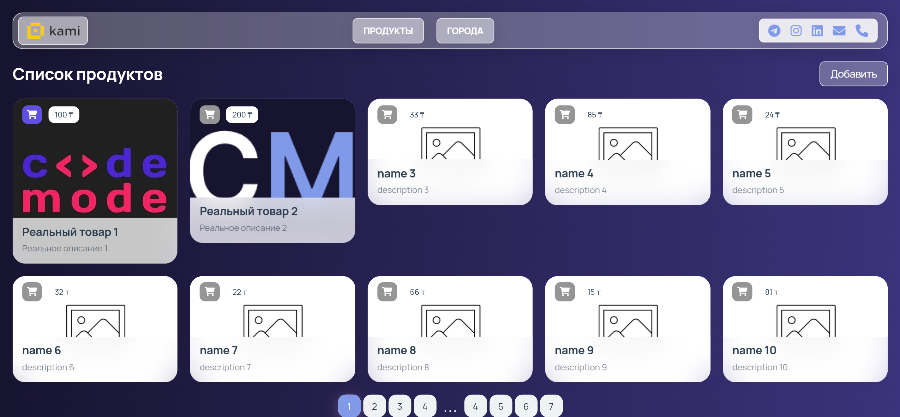
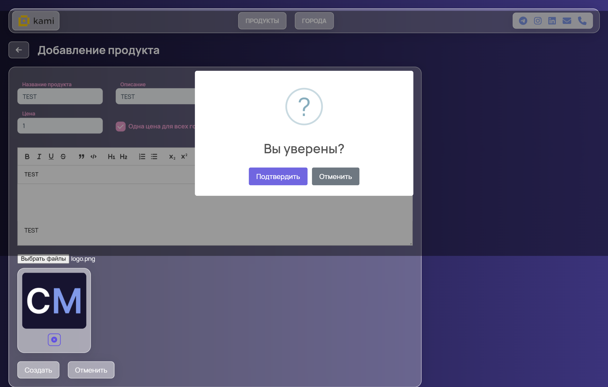

<div id="top"></div>
<div align="center">
<h3 align="center">Тестовое задание для Kami Group</h3>
  <a href="https://github.com/Nura-21/KamiGroup-Products-SPA">
    
  </a>

</div>
<!-- TABLE OF CONTENTS -->
<details>
  <summary>Table of Contents</summary>
  <ol>
    <li>
      <a href="#about-the-project">About The Project</a>
      <ul>
        <li><a href="#built-with">Built With</a></li>
      </ul>
    </li>
    <li>
      <a href="#getting-started">Getting Started</a>
      <ul>
        <li><a href="#prerequisites">Prerequisites</a></li>
        <li><a href="#installation">Installation</a></li>
      </ul>
    </li>
    <li><a href="#contributing">Contributing</a></li>
    <li><a href="#contact">Contact</a></li>
  </ol>
</details>

<!-- ABOUT THE PROJECT -->

## Проект

<div align="center">
<h5>Главная страница</h3>
  </img>
  </img>
</div>

<div align="center">
<h5>Страница "Продукты"</h3>
    <div align="center">
        
        
    </div>
    <div align="center">
        
        
    </div>
</div>

<div align="center">
<h5>Страница "Города"</h3>
    <div align="center">
        
        
    </div>
    <div align="center">
        
        
    </div>
</div>

<div align="center" >
<h5>Создание/Изменение продуктов</h3>
    <div align="center">
        
        
        
    </div>
</div>
<br>

<div align="center" >
<h5>Создание/Изменение городов</h3>
    <div align="center">
        
        
        
    </div>
</div>
<br>

<div align="center" >
<h5>Создание/Изменение городов</h3>
    <div align="center">
        
        
        
    </div>
</div>
<br>

<div align="center" >
<h5>Модалки</h3>
    <div align="center">
        
        
        
    </div>
</div>
<br>

Проект из себя представляет SPA-шку, которая работает с каким-то API с продуктами и городами.

<p align="right">(<a href="#top">back to top</a>)</p>

### Built With

In this project:

- [Vue.2x](https://vuejs.org/)
- [Vuex](https://vuex.vuejs.org/)
- [Vuesax (UI)](https://vuesax.com/)
- [mockapi.io](https://mockapi.io/)
- [SCSS, SASS](https://sass-lang.com/)
- [Font Awesome Icons](https://fontawesome.com/)

<p align="right">(<a href="#top">back to top</a>)</p>

<!-- GETTING STARTED -->

## Getting Started

To start this run this project you should have NodeJs(Vue). Then clone this repository.

### Prerequisites

[NodeJS](https://nodejs.org/en/)

```
yarn install
```

### Compiles and hot-reloads for development
```
yarn serve
```


### Front

This project was generated with [Vue CLI](https://github.com/angular/angular-cli) version 2.x.

### Installation

_After installed prerequisites you can start and other libraries you can start running the project._

1. Clone the repo
   ```sh
   git clone https://github.com/Nura-21/KamiGroup-Products-SPA
   ```
2. Install dependencies.
   ```js
   yarn install
   ```
3. Run server.
   ```js
   yarn serve
   ```
    <p align="center">Enjoy <3 </p>

<p align="right">(<a href="#top">back to top</a>)</p>

<!-- CONTRIBUTING -->

## Contributing

1. Fork the Project
2. Create your Feature Branch (`git checkout -b feature/AmazingFeature`)
3. Commit your Changes (`git commit -m 'Add some AmazingFeature'`)
4. Push to the Branch (`git push origin feature/AmazingFeature`)
5. Open a Pull Request

<p align="right">(<a href="#top">back to top</a>)</p>

<!-- CONTACT -->

## Contact
[Nura](https://www.instagram.com/trdln_/) - n_turdalin@kbtu.kz

Project Link: [SPA for PRODUCTS](https://github.com/Nura-21/KamiGroup-Products-SPA)

[![Nura][instan-shield]][in]
[![Nura][tn-shield]][tn]

<p align="right">(<a href="#top">back to top</a>)</p>

<!-- MARKDOWN LINKS & IMAGES -->
<!-- https://www.markdownguide.org/basic-syntax/#reference-style-links -->

[github-url]: https://github.com/Nura-21/Arbuz.kz-Order-Form
[insta-shield]: https://img.shields.io/badge/Instagram-4805c5?style=for-the-badge&logo=Instagram&logoColor=white
[tele-shield]: https://img.shields.io/badge/Telegram-4805c5?style=for-the-badge&logo=Telegram&logoColor=white
[instan-shield]: https://img.shields.io/badge/Nurassyl-000?style=for-the-badge&logo=Instagram&logoColor=white
[tn-shield]: https://img.shields.io/badge/Nurassyl-000?style=for-the-badge&logo=Telegram&logoColor=white
[tn]: https://t.me/trdln
[in]: https://www.instagram.com/trdln_/

### Compiles and minifies for production
```
yarn build
```

### Customize configuration
See [Configuration Reference](https://cli.vuejs.org/config/).
